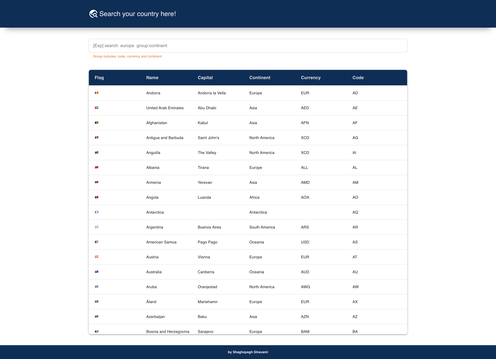
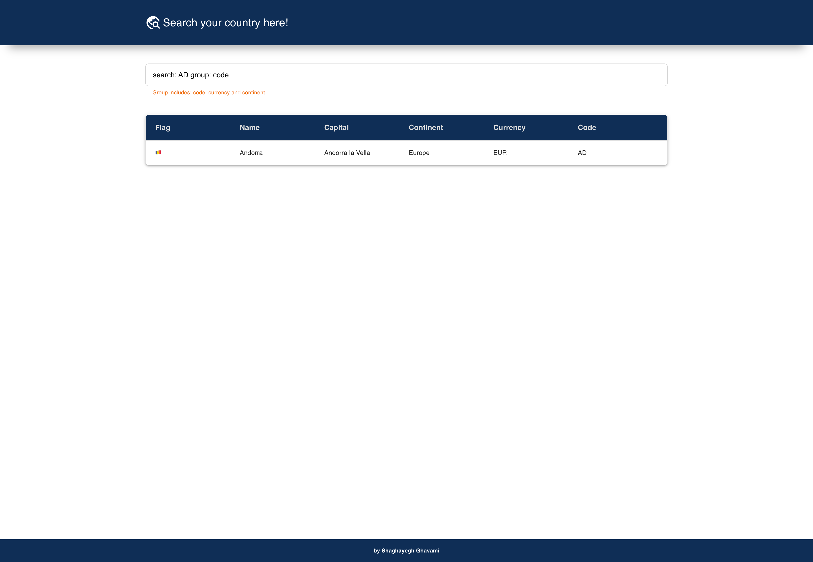

# Countries App

## About

This project is an example SPA written in `React` with `JavaScript` that shows a list of countries with their details using a public `GraphQL API.` When a country is clicked, the country's background will be changed. It is possible to search by code, continent and currency.

The project uses a  public GraphQL API at this address: https://countries.trevorblades.com

TypeScript version: [github.com/shaghayegh-gh/react-countries-graph-ql-ts](https://github.com/shaghayegh-gh/react-countries-graph-ql-ts)


## How it looks
<br/>
<p align='center'>

</p>
<br/>

## How it works
- Example value in the search box: `search: AD group: code`
- The value of search can be:
- When the value of `search` is `continent`, the value of `group` should be the continent code, not the continent name.

<br/>
<p align='center'>

</p>
<br/>

## Prerequisites
- Install [NodeJs](https://nodejs.org/en/download/)
- Install [NPM](https://docs.npmjs.com/downloading-and-installing-node-js-and-npm)

## Getting started
Install all the packages and run the project using the below commands:

```bash
# Install packages
npm install

# Start the project
npm start
```

The last command runs the app in the development mode. Now, open [http://localhost:3000](http://localhost:3000) to view it in your browser.

### Dependencies added
- `graphql`
- `@apollo/client`
- `@emotion/react`
- `@emotion/styled`
- `@mui/material`
- `@mui/icons-material`
- `react-debounce-input`
- `react-infinite-scroller`
